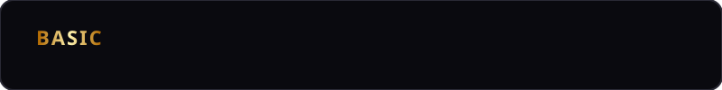

  
  
  
  
   
  
<i>3rd Year Computer Science</i>

  
  
  

 

**Kenji Ludivese**, ign: *Seraph* or *Seraph Kizhin*, currently a 3rd Year Computer Science student at Cebu Institute of Technology - University.

- Learning **C++** and **Python**
- Making a **Godot** Desktop Singleplayer Game

 

